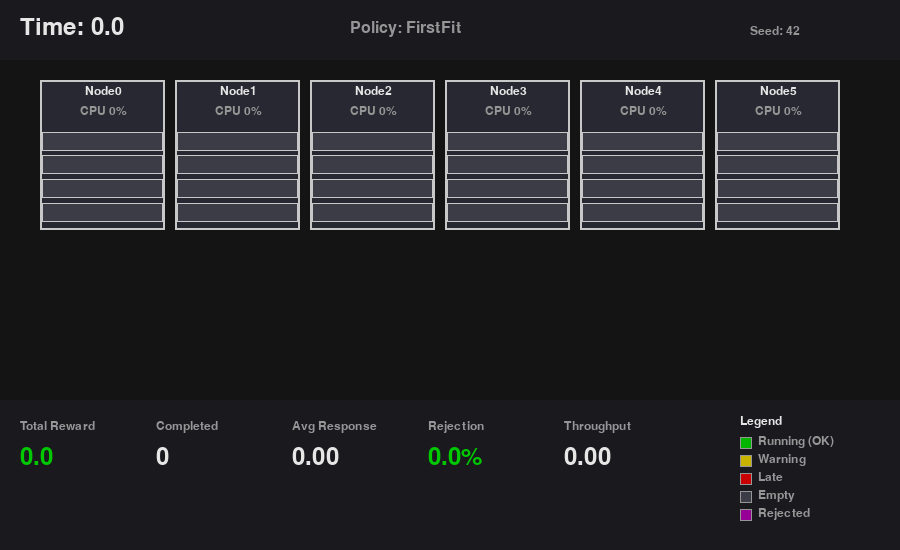

# 🖥️ RackOpt

**A visual cluster/datacenter simulation environment for task scheduling research.**

RackOpt simulates a cluster of computing nodes where tasks arrive over time and must be allocated to available resources. It's designed for researchers and students working on:

- 🤖 **Reinforcement Learning** for resource management
- 📊 **Online Scheduling Algorithms** evaluation
- 🔬 **Workload Characterization** studies
- 🎯 **Optimization Heuristics** benchmarking

[](https://www.python.org/downloads/)
[](https://www.gnu.org/licenses/gpl-3.0)

---

## 🎬 Demo



*Visualization showing tasks being allocated to cluster nodes in real-time. Green slots = running tasks, empty slots = available capacity.*

---

## 📖 What is RackOpt?

### The Problem

In a datacenter or cloud environment, computing tasks constantly arrive and need to be assigned to servers (nodes). Each task requires resources (CPU, RAM, GPU) and has constraints like deadlines. The **scheduler** must decide:

- **Where** to place each task (which node?)
- **When** to run it (now or wait?)
- **Whether** to reject it (if resources are insufficient)

Bad scheduling leads to:
- ❌ Wasted resources (idle servers)
- ❌ SLA violations (missed deadlines)
- ❌ Poor user experience (rejected tasks)

### The Solution

RackOpt provides a **simulation environment** where you can:

1. **Test scheduling algorithms** without a real cluster
2. **Train RL agents** to learn optimal scheduling policies
3. **Visualize** what's happening in real-time
4. **Compare** different approaches fairly

```
                    ┌─────────────────────────────────────────┐
                    │           RackOpt Simulator             │
                    ├─────────────────────────────────────────┤
   Tasks Arrive     │  ┌──────┐ ┌──────┐ ┌──────┐ ┌──────┐   │
   ─────────────►   │  │Node 0│ │Node 1│ │Node 2│ │Node 3│   │
   (CPU, RAM,       │  │ ████ │ │ ██   │ │      │ │ ███  │   │
    deadline)       │  │ ████ │ │      │ │      │ │      │   │
                    │  └──────┘ └──────┘ └──────┘ └──────┘   │
                    │                                         │
   Your Policy      │  Metrics: Completed, Rejected, SLA...  │
   ◄─────────────   │  Reward: +1 complete, -10 reject, ...  │
   (allocate to     └─────────────────────────────────────────┘
    node X)
```

---

## 🚀 Quick Start

### Installation

```bash
# Clone the repository
git clone https://github.com/PJarbas/rackopt.git
cd rackopt

# Create virtual environment
python -m venv .venv
source .venv/bin/activate  # Linux/Mac
# or: .venv\Scripts\activate  # Windows

# Install with all dependencies
pip install -e ".[all]"
```

### Run Your First Simulation

```python
from rackopt import ClusterEnv, ClusterConfig
from rackopt.policies.heuristics import FirstFit

# Create a cluster with 4 nodes
config = ClusterConfig(
    num_nodes=4,
    node_resources={"cpu": 16.0, "ram": 64.0},
)

# Create environment
env = ClusterEnv(config, seed=42)

# Use FirstFit scheduling policy
policy = FirstFit()

# Run simulation
obs = env.reset()
while not env.done:
    action = policy.select_action(obs)
    obs, reward, done, info = env.step(action)

# Print results
print(f"Total Reward: {env.total_reward:.2f}")
env.metrics.print_summary()
```

**Output:**
```
============================================================
SIMULATION METRICS SUMMARY
============================================================
Tasks Arrived:     100
Tasks Completed:   98
Tasks Rejected:    2
SLA Violations:    5

Rejection Rate:    2.00%

Response Time Statistics:
  Mean:  12.45
  P95:   28.30
============================================================
```

### Run with Visualization

```python
from rackopt import ClusterEnv, ClusterConfig
from rackopt.policies.heuristics import FirstFit
from rackopt.viz.pygame_rack import PygameRackRenderer

# Create environment
config = ClusterConfig(num_nodes=6, node_resources={"cpu": 16.0, "ram": 64.0})
env = ClusterEnv(config, seed=42)
policy = FirstFit()

# Create visual renderer
renderer = PygameRackRenderer(env, width=1000, height=600)

# Run with visualization
obs = env.reset()
while not env.done:
    renderer.render_step()  # Update display
    
    if renderer.closed:  # User closed window
        break
        
    action = policy.select_action(obs)
    obs, reward, done, info = env.step(action)

renderer.close()
```

---

## 📚 Core Concepts

### 1. Tasks

Tasks arrive over time with resource requirements:

```python
# A task needs:
task = {
    "cpu": 4.0,        # 4 CPU cores
    "ram": 8.0,        # 8 GB RAM
    "duration": 30.0,  # Runs for 30 time units
    "deadline": 100.0, # Must complete by time 100
}
```

### 2. Nodes

Nodes are servers with fixed capacity:

```python
# A node has:
node = {
    "cpu": 16.0,  # 16 CPU cores total
    "ram": 64.0,  # 64 GB RAM total
}
# Multiple tasks can run on a node if resources fit
```

### 3. Actions

Your policy decides where to place each pending task:

```python
from rackopt.core.action import Action, REJECT

action = Action()
action.add_decision(task_id=1, node_id=0)    # Place task 1 on node 0
action.add_decision(task_id=2, node_id=2)    # Place task 2 on node 2
action.add_decision(task_id=3, REJECT)       # Reject task 3
```

### 4. Observations

After each step, you observe the cluster state:

```python
obs = env.step(action)

# What you can see:
obs.current_time          # Current simulation time
obs.pending_tasks         # Tasks waiting for allocation
obs.running_tasks         # Tasks currently running
obs.nodes                 # State of each node (usage, capacity)
obs.nodes[0].utilization  # {'cpu': 0.75, 'ram': 0.5}
```

### 5. Rewards

The environment returns rewards based on your decisions:

| Event | Default Reward |
|-------|---------------|
| Task completed | +1.0 |
| Task rejected | -10.0 |
| SLA violation (deadline missed) | -5.0 |
| Invalid action | -1.0 |

---

## 🎮 Built-in Policies

RackOpt includes several scheduling policies to compare against:

```python
from rackopt.policies.heuristics import (
    FirstFit,      # Allocate to first node with space
    BestFit,       # Allocate to node with least waste
    WorstFit,      # Allocate to node with most space
    RandomPolicy,  # Random node selection
    RoundRobin,    # Rotate through nodes
    PriorityPolicy # Prioritize high-priority tasks
)

# Use any policy:
policy = BestFit()
action = policy.select_action(observation)
```

---

## 🔧 Custom Policies

Create your own scheduling policy:

```python
from rackopt.policies.base import BasePolicy
from rackopt.core.action import Action, REJECT

class MySmartPolicy(BasePolicy):
    """My custom scheduling policy."""
    
    def select_action(self, obs):
        action = Action()
        
        for task in obs.pending_tasks:
            best_node = None
            best_score = -1
            
            # Find best node for this task
            for node in obs.nodes:
                if self._can_fit(task, node):
                    score = self._calculate_score(task, node)
                    if score > best_score:
                        best_score = score
                        best_node = node.node_id
            
            if best_node is not None:
                action.add_decision(task.task_id, best_node)
            else:
                action.add_decision(task.task_id, REJECT)
        
        return action
    
    def _can_fit(self, task, node):
        for resource, demand in task.demands.items():
            available = node.capacity[resource] - node.usage.get(resource, 0)
            if demand > available:
                return False
        return True
    
    def _calculate_score(self, task, node):
        # Your scoring logic here
        return node.utilization.get('cpu', 0)  # Example: prefer busier nodes

# Use it:
policy = MySmartPolicy()
```

---

## 📊 Configuration

### Cluster Configuration

```python
from rackopt.config.config import ClusterConfig, WorkloadConfig

config = ClusterConfig(
    # Cluster setup
    num_nodes=8,                              # Number of servers
    node_resources={"cpu": 32, "ram": 128},   # Resources per node
    heterogeneous=True,                       # Vary node capacities
    
    # Workload settings
    workload=WorkloadConfig(
        arrival_rate=2.0,                     # Tasks per time unit
        num_tasks=500,                        # Total tasks to generate
        resource_demands={
            "cpu": {"min": 1, "max": 8},
            "ram": {"min": 2, "max": 32},
        },
        deadline_probability=0.5,             # 50% of tasks have deadlines
    ),
    
    # Simulation settings
    max_simulation_time=1000.0,
    seed=42,
)
```

### Using Preset Configurations

```python
from rackopt.config.config import ConfigProfiles

# Ready-to-use configurations:
config = ConfigProfiles.small_cluster()       # 4 nodes, light load
config = ConfigProfiles.medium_cluster()      # 16 nodes, medium load
config = ConfigProfiles.large_cluster()       # 50 nodes, heavy load
config = ConfigProfiles.batch_workload()      # Long-running batch jobs
config = ConfigProfiles.interactive_workload() # Short interactive tasks
```

### Load from YAML

```yaml
# config.yaml
num_nodes: 8
node_resources:
  cpu: 32.0
  ram: 128.0
  gpu: 4.0

workload:
  arrival_rate: 1.5
  num_tasks: 200
  deadline_probability: 0.3

max_simulation_time: 500.0
seed: 42
```

```python
config = ClusterConfig.from_yaml("config.yaml")
```

---

## 🔬 Validating Your Environment

Before training RL agents, validate the environment works correctly:

```python
from rackopt.utils.diagnostics import EnvironmentDiagnostics

def env_factory(seed=42):
    config = ClusterConfig(num_nodes=4, node_resources={"cpu": 16, "ram": 64})
    return ClusterEnv(config, seed=seed)

def policy_factory():
    return FirstFit()

# Run diagnostics
diagnostics = EnvironmentDiagnostics()
diagnostics.run_all_tests(env_factory, policy_factory)
```

**Output:**
```
🔬 RackOpt Environment Diagnostics

🧪 Test: Determinism (same seed → same results)
   ✅ Environment is deterministic

🧪 Test: Reset Independence
   ✅ Reset properly clears state

🧪 Test: Action Effects
   ✅ Task allocation works correctly

🧪 Test: Reward Sanity
   ✅ Good policy (12.0) > Bad policy (-1000.0)

📊 Results Summary
✅ Passed: 6
❌ Failed: 0
```

---

## 📈 Tracking Learning Progress

Monitor if your RL agent is improving:

```python
from rackopt.utils.diagnostics import LearningTracker

tracker = LearningTracker()

# During training loop:
for episode in range(1000):
    obs = env.reset()
    total_reward = 0
    steps = 0
    
    while not env.done:
        action = agent.select_action(obs)
        obs, reward, done, info = env.step(action)
        total_reward += reward
        steps += 1
    
    # Record episode results
    tracker.record_episode(total_reward, steps)

# Check progress
tracker.print_summary()
tracker.plot_learning_curve("learning_curve.png")

if tracker.is_improving():
    print("✅ Agent is learning!")
```

---

## 🎥 Recording Simulations

Save simulations as video files:

```python
renderer = PygameRackRenderer(
    env,
    record_video=True,
    video_path="output/my_simulation.avi"
)

# Run simulation...
# Video is saved automatically when renderer.close() is called
```

Save screenshots:

```python
renderer.save_screenshot("output/frame.png")
```

---

## 📁 Project Structure

```
rackopt/
├── src/rackopt/
│   ├── core/           # Data models (Task, Node, Observation, Action)
│   ├── env/            # Simulation environment and events
│   ├── config/         # Configuration management
│   ├── workload/       # Task generation and trace loading
│   ├── policies/       # Scheduling algorithms
│   ├── metrics/        # Performance tracking
│   ├── viz/            # Pygame visualization
│   └── utils/          # Diagnostics and helpers
├── examples/           # Example scripts
├── tests/              # Unit tests
└── assets/             # Images and demo files
```

---

## 📖 Examples

| Example | Description |
|---------|-------------|
| `01_hello_world.py` | Basic simulation without visualization |
| `02_with_pygame.py` | Real-time visualization |
| `03_workload_comparison.py` | Compare policies across workloads |
| `04_trace_loading.py` | Load tasks from CSV/JSON files |
| `05_custom_policy.py` | Implement your own policy |
| `06_record_video.py` | Record simulation to video |
| `07_diagnostics.py` | Validate environment and track learning |

Run any example:

```bash
cd rackopt
source .venv/bin/activate
python examples/01_hello_world.py
```

---

## 🤖 Integration with RL Libraries

RackOpt uses a Gym-like API but without the Gymnasium dependency:

```python
# Standard RL loop
obs = env.reset()                              # Get initial observation
action = policy.select_action(obs)             # Your policy decides
obs, reward, done, info = env.step(action)     # Environment responds
```

You can easily wrap it for Stable-Baselines3, RLlib, or other frameworks.

---

## 📦 Requirements

- Python 3.10+
- numpy
- pydantic
- PyYAML
- pygame (optional, for visualization)
- opencv-python (optional, for video recording)
- matplotlib (optional, for plotting)

---

## 🤝 Contributing

Contributions are welcome! Please feel free to submit issues and pull requests.

---

## 📄 License

GPL-3.0 License - see [LICENSE](LICENSE) for details.

---

## 📚 Citation

If you use RackOpt in your research, please cite:

```bibtex
@software{rackopt2025,
  title={RackOpt: Visual Cluster Simulation for Task Scheduling Research},
  author={RackOpt Contributors},
  year={2025},
  url={https://github.com/PJarbas/rackopt}
}
```

---

## 🙏 Acknowledgments

RackOpt was designed for research in:
- Resource allocation optimization
- Online scheduling algorithms  
- Reinforcement learning for systems
- Workload characterization

---

<p align="center">
  Made with ❤️ for the research community
</p>
